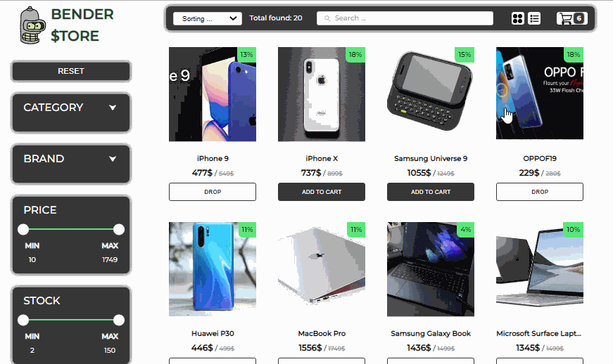

# Bender Store
### Ссылка на прототип:

https://bender-store.netlify.app/

## Preview

## Описание

Онлайн магазин товаров различных категорий.

Технологии используемые на проекте:  

 

В проекте реализовано:
- Главная страница со списком товаров:
  - Пагинация
  - Сортировка товаров по разным признакам
  - Отображение количества найденных товаров
  - Выбор варианта отображения товаров списком или плиткой
  - Отображение количества товаров в корзине
  - Фильтрация товаров по категории и бренду
  - Фильтрация товаров по диапазону стоимости и остатка на складе (в разработке)
  - Кнопка сброса фильтров
  - Кнопка удаления/добавления в корзину
- Страница товара с описанием:
  - Фотографии товара с переключением между собой
  - Блок описания товара
  - Кнопка удаления/добавления в корзину
  - Кнопка оформления заказа
- Корзина товаров:
  - Пагинация
  - Добавление/удаление количества товара
  - При достижении количества 0 товар удаляется из корзины
  - Блок с количеством товаров в корзине и общей стоимостью
  - Кнопка для оформления заказа
- Форма для оформления заказа:
  - Валидация по всем полям
  - Отображение платежной системы в зависимости от введенного номера карты

## Особенности проекта

- Кроссбраузерная, семантическая верстка
- Приложение адаптировано под мобильные устройства
- Поиск товаров по названию с любой страницы приложения
- Различная плавная анимация
- Индикаторы загрузки во время получения ответа от сервера
- Отображение ошибок, полученных при работе с сервером
- Реализована страница 404 при введении некорректного URL
- Так как работа осуществляется с бесплатным API, возможны частые ошибки 429 в связи с ограничением по количеству запросов в единицу времени
